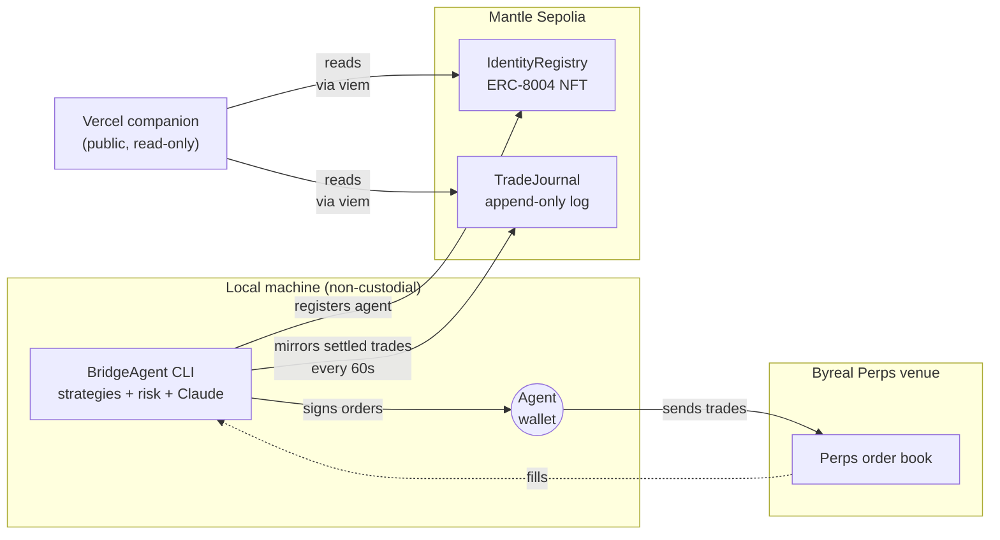

# BridgeAgent

> Byreal-bootstrapped, Mantle-anchored agentic perps trading.
> Infrastructure for verifiable agentic trading — reduces information asymmetry between retail and institutional traders.

**[Mantle Turing Test 2026 Hackathon](https://dorahacks.io/hackathon/mantleturingtesthackathon2026/detail) submission.**
Track: **AI Trading & Strategy** · also nominated for **Top 20 Deployment Award**.

BridgeAgent working autonomous perps trading agent.

- **Trading** runs through Byreal Perps' venue.
- **Identity + provenance** lives on Mantle Sepolia: every agent has an **ERC-8004 identity NFT**, every settled trade is mirrored to an on-chain **TradeJournal** contract.
- **Local-first**: a non-custodial agent wallet on your machine, signing every order. No web dashboard, no key custody.

> The bet: as trading moves from manual clicks to agents, the trusted interface won't be another dashboard. It'll be a local CLI that talks to your wallet and runs on your machine — and can prove what it did, on-chain.

---

## What's in this repo

```
bridgeagent/        Python CLI + TUI
  src/bridgeagent/
    venue/          Venue protocol + venue implementation
    mantle/         On-chain mirror: client, IdentityRegistry helper, TradeJournal helper
    strategies/     7 quant strategies (trend, momentum, funding, vol, pairs, cascade, ...)
    core/           Risk layer, regime detector, candle cache, agent state
    tui/            Textual UI (dashboard, journal, analytics, etc.)
    onboarding/     Setup wizard
  scripts/          mantle_smoke_test.py, runtime_mirror_smoke.py

contracts/          Foundry project
  src/
    IdentityRegistry.sol    ERC-8004 minimal (NFT per agent)
    TradeJournal.sol        Append-only on-chain log of settled trades
  test/             13/13 tests pass
  script/Deploy.s.sol

web/                Next.js 15 + viem read-only status page
  app/page.tsx      Server-rendered Mantle reads, no wallet connect
  lib/              chain config, ABIs, contract handles, data fetchers
  components/       AgentCard, TradesTable

docs/
  setup.md          Local-run runbook (clone → fund → run → verify)
  demo-script.md    2-min demo video walkthrough
  hackathon.md      Hackathon brief + tracks reference
```

---

## Architecture



Reads as a story: strategies decide → agent wallet signs → order goes to Byreal Perps → fills come back → settled trades are anchored on Mantle → public companion reads the chain.

---

## Live on Mantle Sepolia (chain 5003)

| Contract | Address |
|---|---|
| IdentityRegistry | [`0x7FDF67698D0A83EB97eA770D9bcA66d3557556c0`](https://explorer.sepolia.mantle.xyz/address/0x7FDF67698D0A83EB97eA770D9bcA66d3557556c0) |
| TradeJournal | [`0x0E36Df3b90A2B4868Ecd7a5974A16A5c1C5a2110`](https://explorer.sepolia.mantle.xyz/address/0x0E36Df3b90A2B4868Ecd7a5974A16A5c1C5a2110) |

Web companion: deployed on Vercel (URL in DoraHacks submission).

---

## How it works

**On-chain verifiability (the core deliverable).** Every settled trade is mirrored to Mantle Sepolia via `TradeJournal.record(agentId, tradeHash, pnlBps, closedAt)` — an append-only public log gated by `IdentityRegistry.ownerOf(agentId)` so Sybil writes are impossible. The agent's identity itself is an **ERC-8004 NFT** on a custom registry. Reputation, history, and behavior are public. A background worker flushes settled trades to chain every 60s. See `docs/why-this-architecture.md`.

**Risk layer.** A deterministic safety boundary that sits between strategy signals and the venue. Trailing stops (software, polled every 2s, high-water-mark tracked), native venue TP/SL backups, daily loss limits ($100 absolute or 5% of account, whichever stricter), position size caps (`MAX_POSITION_SIZE_USD=200`, `MAX_CONCURRENT_POSITIONS=5`), correlation guards (no multi-leg exposure in correlated baskets), net-directional caps, and 5-min cooldowns. See `docs/risk-architecture.md` for the full layer.

**Strategy engine.** 7 weighted-scoring strategies running in parallel: trend follower, momentum, funding sniper, volatility breakout, pairs reversion, liquidation cascade, orderbook imbalance. Each emits signals 0–100; the regime detector (ADX(14) + Bollinger band-width on 4h candles) classifies markets as trending / ranging / squeeze every 5 minutes. Claude Haiku via AWS Bedrock explains high-conviction signals (score ≥ 55) — addresses the BGA dimension on reducing black-box opacity in autonomous trading.

**Bootstrap.** A non-custodial agent wallet (trade-only, can't withdraw) is created locally — either through the existing setup wizard, or in the future through Byreal Perps CLI's `account init`. Orders execute on the perps testnet through Byreal Perps' venue. Once live, the agent is registered on Mantle as an ERC-8004 NFT. The Vercel companion (server-rendered, no wallet connect) reads both contracts directly via viem.

`★ Reading order for someone new to the code`
1. `contracts/src/IdentityRegistry.sol` and `TradeJournal.sol` — the on-chain truth (~150 LOC total)
2. `bridgeagent/src/bridgeagent/mantle/trade_journal.py` — the bridge from Python runtime to on-chain
3. `bridgeagent/src/bridgeagent/core/risk.py:_close_and_record` — where settled trades enqueue
4. `bridgeagent/src/bridgeagent/app.py:run_mantle_flush` — the background flush worker
5. `web/app/page.tsx` + `web/lib/data.ts` — how the on-chain data renders publicly

---

## What this scores against (AI Trading & Strategy / BGA)

For judges reading the published [scorecard](https://dorahacks.io/hackathon/mantleturingtesthackathon2026/detail) alongside this repo. Where each Part B (BGA) dimension is implemented:

| Dimension | Pts | Where in this repo |
|---|---|---|
| Alignment with BGA ethos | 10 | Whole project — public, append-only trade record + open-source signal logic + explainable AI. *"Reduces information asymmetry."* |
| Innovation & technical depth | 10 | `contracts/src/IdentityRegistry.sol` + `TradeJournal.sol`, `bridgeagent/src/bridgeagent/venue/base.py` (venue protocol), `bridgeagent/src/bridgeagent/core/regime.py` |
| Strategy design & risk management | 7.5 | `bridgeagent/src/bridgeagent/core/risk.py` + `docs/risk-architecture.md` |
| Transparency & verifiability | 7.5 | `bridgeagent/src/bridgeagent/mantle/trade_journal.py`, contracts on Mantle Sepolia, Vercel companion at the URL above |
| Real-world impact | 5 | `docs/why-this-architecture.md` — the agentic-trust thesis |
| User accessibility & UX | 5 | `web/app/page.tsx` (read-only, no wallet connect) |
| Execution & demo quality | 5 | 13/13 unit tests in `contracts/test/`, `docs/demo-script.md`, deployed addresses verified live |

---

## Run it locally

See **[`docs/setup.md`](./docs/setup.md)** for the full runbook (prereqs, env vars per component, funding testnet wallets, running each piece, smoke tests, troubleshooting).

For a quick mental model:

```bash
# 1. Contracts (already deployed; redeploy only if you change them)
cd contracts && forge test && forge build

# 2. Python runtime (TUI)
cd bridgeagent && pip install -e . && bridgeagent setup && bridgeagent

# 3. Web companion
cd web && pnpm install && pnpm dev   # → http://localhost:3000

# 4. End-to-end smoke tests
bridgeagent/scripts/mantle_smoke_test.py
bridgeagent/scripts/runtime_mirror_smoke.py
```

---

## Demo

Demo video (≥2 min walkthrough): see `docs/demo-script.md` for the recording plan.
Live trade flow: TUI fires strategy → settles → `[MANTLE]` flush log → tx visible on Mantle Explorer → Vercel page auto-updates within 30s.

---

## Status (submission day)

- ✅ Foundry contracts deployed + 13/13 tests passing
- ✅ Venue abstraction refactor (7 strategies migrated)
- ✅ Mantle Python integration (client, identity, trade journal)
- ✅ Web companion deployed on Vercel (read-only, no wallet connect)
- ✅ Runtime mirror wired into the trade-close path; live trades visible on-chain
- ⏸ Byreal Perps CLI bootstrap (built; gated on RealClaw beta access — explicit non-goal for this submission, see `docs/submission.md`)

---

## License

MIT.

## Acknowledgements

Built solo for the Mantle Turing Test 2026 Hackathon. Co-sponsored by Mantle, Bybit, Byreal, and the Blockchain for Good Alliance.
